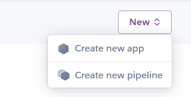
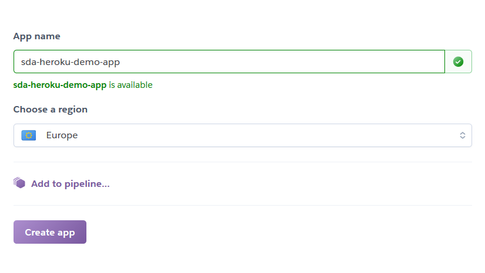
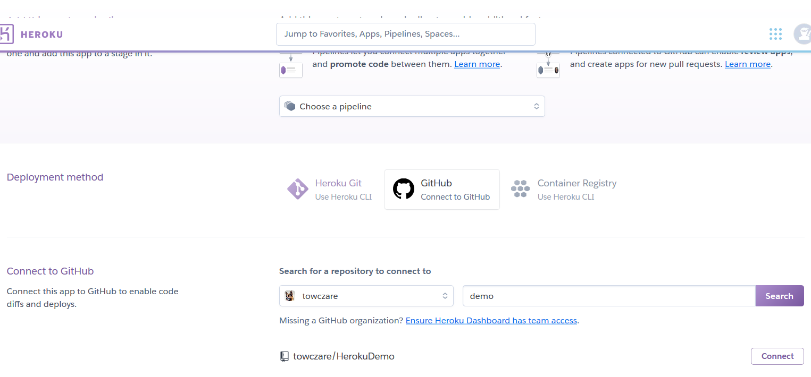
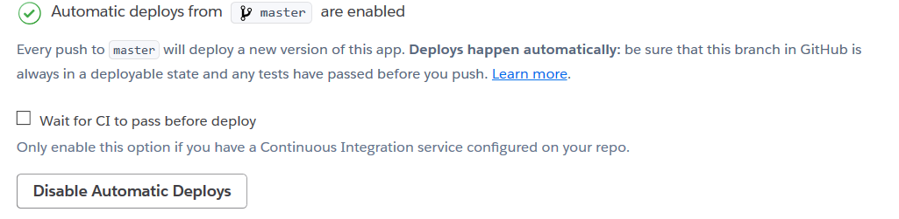
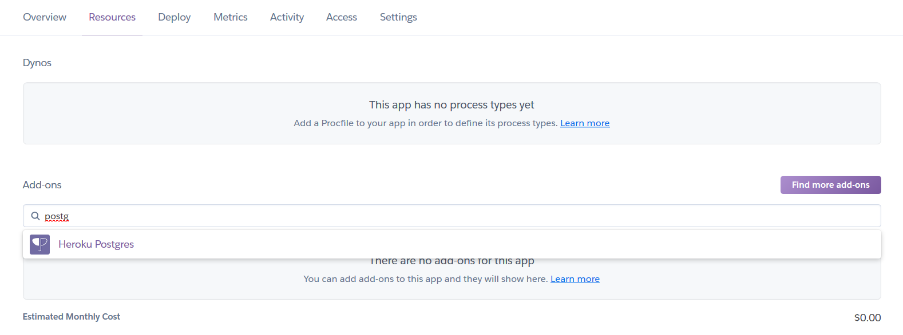
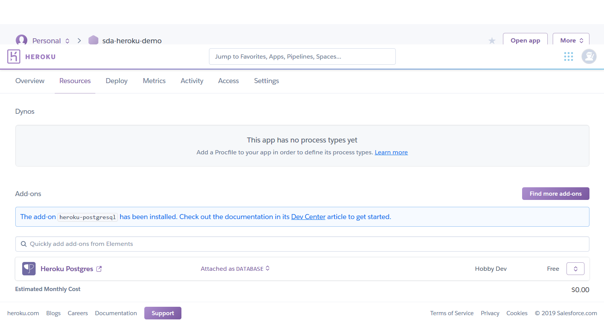
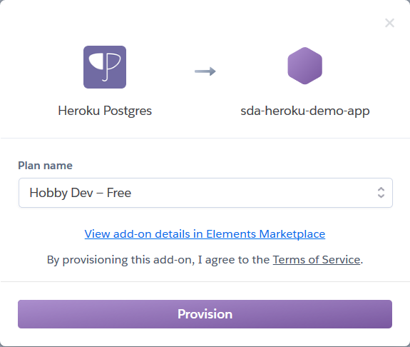
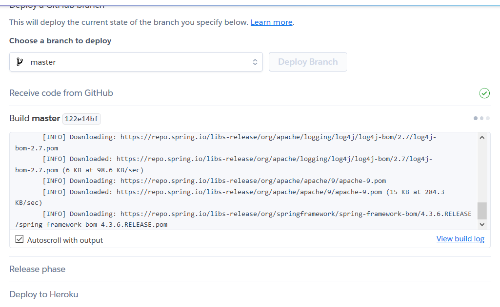
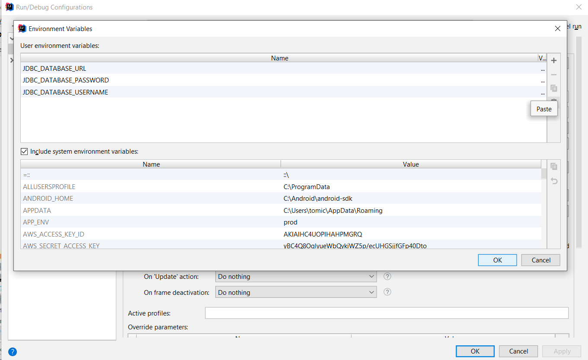

# Spring Boot Heroku Flyway Demo App

Simple example showing how to connect [Spring Boot App](https://spring.io/projects/spring-boot) to [Heroku Database](https://name.heroku.com) with [Flyway library](https://flywaydb.org/) used as database versioning tool.

# Demo
Application is available here 

## Deploying app to Heroku
1. Create new application in Heroku console



2. Configure your github source, by searching project


3. Enable automatic deploys, so each time pull request is merged, new version will be deployed.

4. Switch to addon tab and search postgres addon.




5. Go back to deploy tab and deploy application.

6. Take a look on logs, if everything is fine.

7. Open your app, once it is successfully deployed.


## Configure elephantsql database

This can be usefull for local development purposes, when we don't want to configure database localy. 

1. Create account and database instance on [https://www.elephantsql.com/](https://www.elephantsql.com/)
2. Prepare following env values:
```
JDBC_DATABASE_URL=jdbc:postgresql://rogue.db.elephantsql.com:5432/abcdefgh
JDBC_DATABASE_PASSWORD=1234qwerweeweweedwr_4321gdfgdfdgd
JDBC_DATABASE_USERNAME=abcdefgh
```
3. Paste them in env window in your IntelliJ IDE

4. Run your app.

## Conecting to database from IDE

In case you want to create database for local purposes, follow below steps:

1. Create database using creator in [Heroku database](https://name.heroku.com)
2. Open credential page for newly created database.


3. Now setup connection to your database, using obtained credentials.


This is expected format for your IntelliJ connection
```
jdbc:postgresql://ec2-ho-stn-num-bers.eu-west-1.compute.amazonaws.com:5432/database_name?sslmode=require
```
4. If everything is setup correctly, green *Success* message should appear.


5. Go to your schema tab, and check your database schema.


6. Setup your configuration in environment variables as following:

