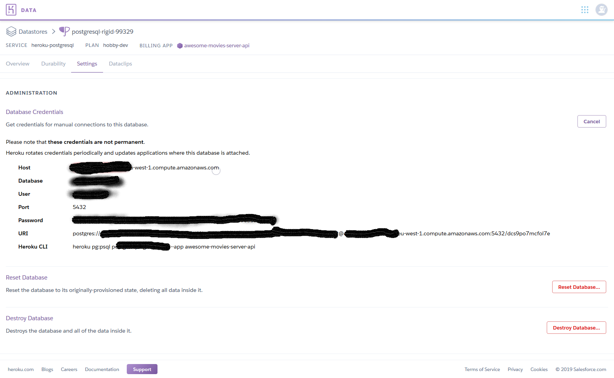
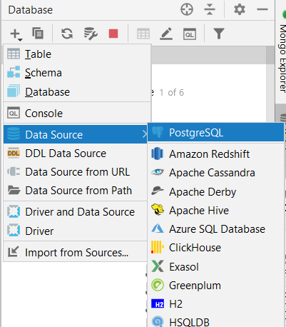
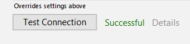
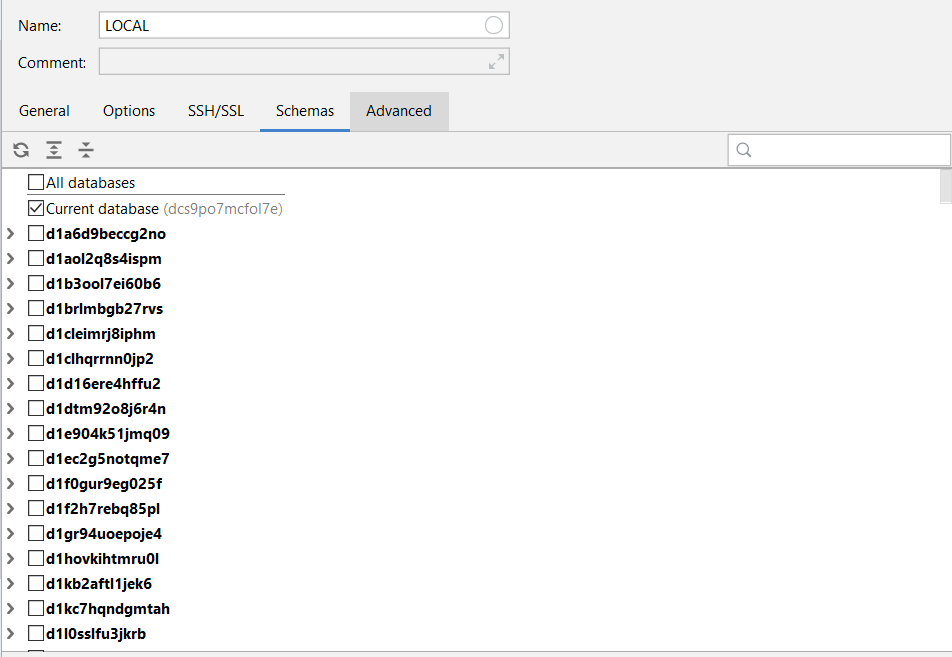
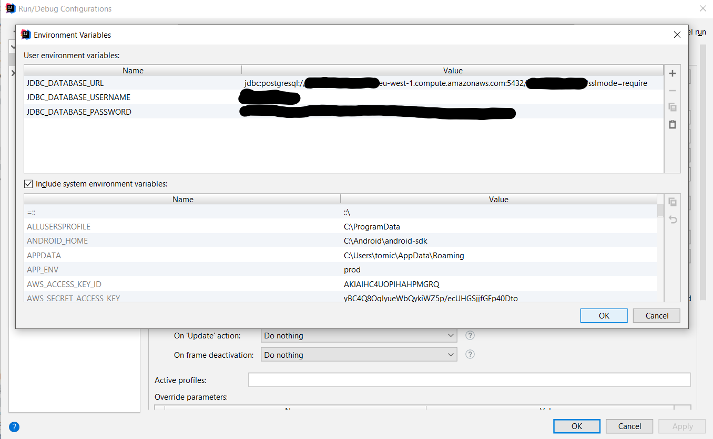

# Spring Boot Heroku Flyway Demo App

Simple example showing how to connect [Spring Boot App](https://spring.io/projects/spring-boot) to [Heroku Database](https://name.heroku.com) with [Flyway library](https://flywaydb.org/) used as database versioning tool.

## Setup
1. Create database using creator in [Heroku database](https://name.heroku.com)
2. Open credential page for newly created database.



3. Now setup connection to your database, using obtained credentials.



This is expected format for your IntelliJ connection
```
jdbc:postgresql://ec2-ho-stn-num-bers.eu-west-1.compute.amazonaws.com:5432/database_name?sslmode=require
```
4. If everything is setup correctly, green *Success* message should appear.



5. Go to your schema tab, and check your database schema.


6. Setup your configuration in environment variables as following:
